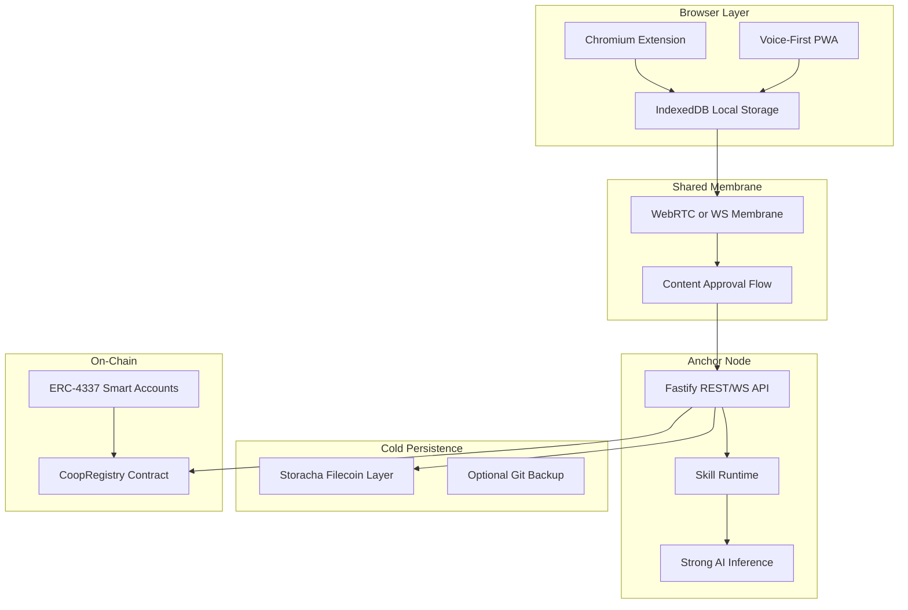

# Coop Development Masterplan

Date: 2026-03-05  
Scope Source: `260305 Luiz X Afo Coffee.md`, `.cursor/plans/coop_monorepo_development_516cb53b.plan.md`, `docs/coop-component-plans.md`

## Project Scope

Coop is a browser-first knowledge commons for local and bioregional coordination. The MVP scope is:

- Chromium extension as the primary interface
- Voice-first PWA companion
- Anchor node for strong AI inference and coordination logic
- Three-layer storage: local node, shared membrane, cold storage
- On-chain Coop registry with smart account patterns
- Four pillars: impact reporting, coordination, governance, capital formation

## Current State

- Monorepo scaffold exists and is restored.
- Component implementation plan exists but is still mostly pending.
- The next work phase is full implementation of component plans and cross-cutting validation.

## Architecture

## Plan Index

| # | Component | Plan File | Status | Priority |
|---|-----------|-----------|--------|----------|
| 0 | Monorepo Scaffold | `00-scaffold-complete.md` | DONE | N/A |
| 1 | Browser Extension | `01-extension.md` | DONE (build pipeline + capture + skills UI) | P0 |
| 2 | Anchor Node | `02-anchor-node.md` | DONE (REST/WS + AI + tests) | P0 |
| 3 | PWA Companion | `03-pwa.md` | DONE (voice-first + offline sync) | P1 |
| 4 | Shared Package | `04-shared-package.md` | DONE (storage/membrane + API types) | P0 |
| 5 | Smart Contracts | `05-contracts.md` | DONE (registry + tests + deploy) | P1 |
| 6 | Org-OS Integration | `06-org-os-integration.md` | TODO | P2 |
| 7 | Skills System | `07-skills-system.md` | DONE (handlers + pillars) | P1 |
| 8 | Cross-Cutting | `08-cross-cutting.md` | DONE (env + tests + docs + QA checklist) | P0 |

## Recommended Execution Order

1. `04-shared-package.md`
2. `01-extension.md`
3. `02-anchor-node.md`
4. `08-cross-cutting.md` (initial env/test baseline)
5. `03-pwa.md`
6. `07-skills-system.md`
7. `05-contracts.md`
8. `06-org-os-integration.md`
9. `08-cross-cutting.md` (final validation pass)

## Coordination Rules for Main Agent and Subagents

- Main agent chooses one plan file per execution block.
- Subagents work only within listed key files per plan.
- Any dependency addition must be recorded in the plan file touched.
- Status changes should be logged directly in this masterplan table during execution cycles.
