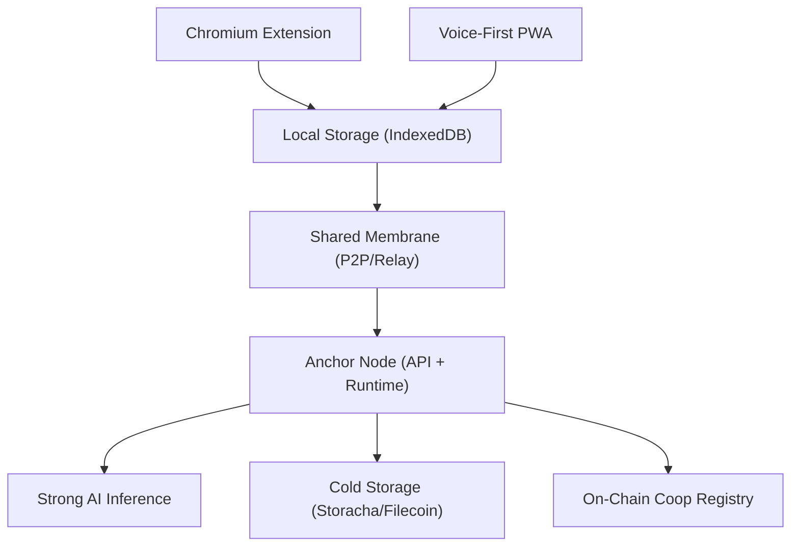

# Coop

Browser-based knowledge commons for local and bioregional coordination.

## Start Here

For a fast, correct execution flow:

1. Read [`.cursor/plans/MASTERPLAN.md`](.cursor/plans/MASTERPLAN.md).
2. Pick the next active component plan in order (`01` to `08`).
3. Read [`.cursor/agents/coop-builder.md`](.cursor/agents/coop-builder.md) for execution/delegation behavior.
4. Apply constraints from [`.cursor/rules/coop-development.mdc`](.cursor/rules/coop-development.mdc).
5. Implement only the selected plan scope, then update plan status.

## What Coop Builds

Coop provides a browser-first coordination stack for communities:

- Chromium extension for capture and coop interaction
- Voice-first PWA for mobile input and participation
- Anchor node for AI processing, sync, and orchestration
- Shared package contracts for protocol and data consistency
- On-chain registry and smart-account-ready integration patterns

## Monorepo Packages

- `packages/extension`: Chromium extension (tab capture, voice dictation, Coop onboarding)
- `packages/pwa`: Mobile companion for voice-first participation
- `packages/anchor`: Anchor node API + agent runtime
- `packages/shared`: Shared types and storage protocol abstractions
- `packages/contracts`: Coop registry and account-abstraction integrations
- `packages/org-os`: Organizational OS schemas and templates imported for Coop setup

## Quick Start

If your local tree is out of sync with committed scaffold:

```bash
git restore .
```

Install and run workspace:

```bash
pnpm install
pnpm dev
```

Common workspace commands:

```bash
pnpm build
pnpm lint
pnpm check
pnpm format
```

Contracts package:

```bash
cd packages/contracts
forge build
forge test
```

## Architecture Overview



## Documentation Index

### Core Product Docs

- [docs/architecture.md](docs/architecture.md) — System architecture overview
- [docs/onboarding-flow.md](docs/onboarding-flow.md) — Coop onboarding process
- [docs/coop-component-plans.md](docs/coop-component-plans.md) — Detailed component planning reference

### Pitch and Delivery Docs

- [docs/pitch/demo-flows.md](docs/pitch/demo-flows.md) — End-to-end demo scripts
- [docs/pitch/hackathon-submission-checklist.md](docs/pitch/hackathon-submission-checklist.md) — Submission readiness checklist
- [docs/pitch/pitch-outline.md](docs/pitch/pitch-outline.md) — Pitch narrative structure

### Agent Execution Index (`.cursor`)

- [`.cursor/rules/coop-development.mdc`](.cursor/rules/coop-development.mdc) — Development guardrails and package conventions
- [`.cursor/agents/coop-builder.md`](.cursor/agents/coop-builder.md) — Main builder-agent operating contract
- [`.cursor/plans/MASTERPLAN.md`](.cursor/plans/MASTERPLAN.md) — Single entrypoint for sequencing all build work

#### Plan Files (Main Agent + Subagents)

- [`.cursor/plans/00-scaffold-complete.md`](.cursor/plans/00-scaffold-complete.md) — Completed scaffold baseline
- [`.cursor/plans/01-extension.md`](.cursor/plans/01-extension.md) — Chromium extension implementation
- [`.cursor/plans/02-anchor-node.md`](.cursor/plans/02-anchor-node.md) — Anchor backend and runtime
- [`.cursor/plans/03-pwa.md`](.cursor/plans/03-pwa.md) — Voice-first PWA implementation
- [`.cursor/plans/04-shared-package.md`](.cursor/plans/04-shared-package.md) — Shared contracts and storage layers
- [`.cursor/plans/05-contracts.md`](.cursor/plans/05-contracts.md) — Coop registry and smart accounts
- [`.cursor/plans/06-org-os-integration.md`](.cursor/plans/06-org-os-integration.md) — Org-OS alignment and setup
- [`.cursor/plans/07-skills-system.md`](.cursor/plans/07-skills-system.md) — Pillar skills and handlers
- [`.cursor/plans/08-cross-cutting.md`](.cursor/plans/08-cross-cutting.md) — Env, testing, and release checks

## Core MVP Pillars

- Impact reporting
- Coordination
- Governance
- Capital formation

## Upstream Connections

- Standards and template source: [`organizational-os`](https://github.com/regen-coordination/organizational-os)
- Federation and coordination hub: [`regen-coordination-os`](https://github.com/regen-coordination/regen-coordination-os)
- Scope definition input: `260305 Luiz X Afo Coffee.md`
