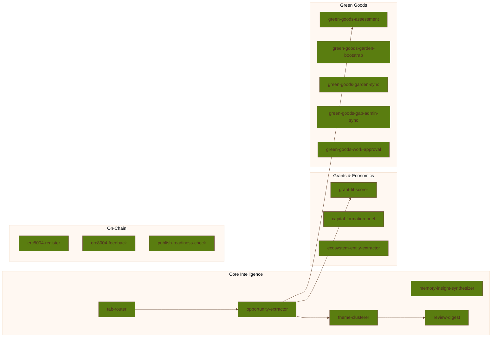
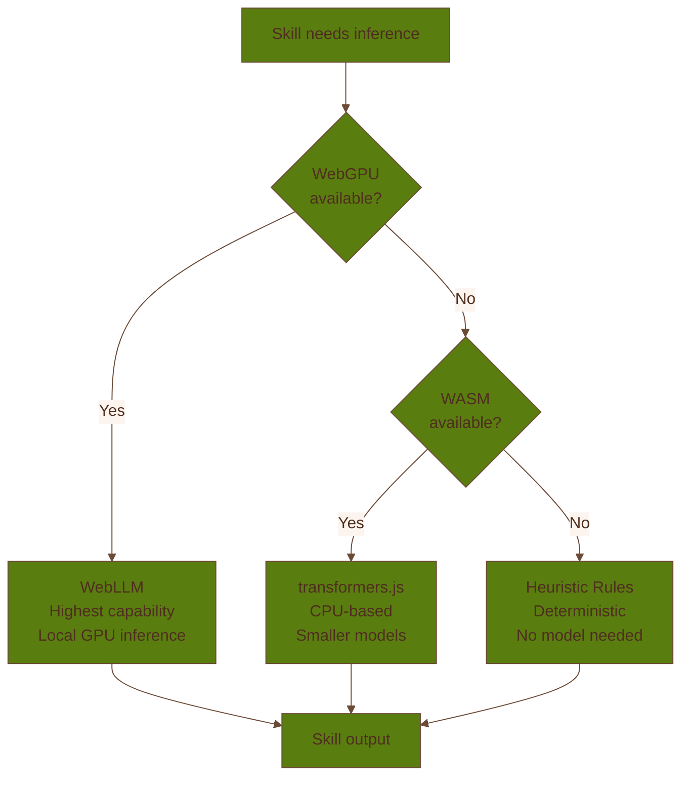

# Agentic Harness

Coop runs a browser-native observe → plan → act loop inside the extension. The harness is designed
to be useful before it is fully autonomous.

## Core Loop

Each cycle does six things:

1. observe local state for actionable triggers
2. deduplicate observations by fingerprint
3. plan skill execution through a dependency graph
4. execute skills through the inference cascade
5. emit drafts or action proposals
6. log trace data for review and debugging

## Skill System

The harness currently has 16 registered skills. Skills are defined via `SKILL.md` files loaded at
build time through `import.meta.glob` from `skills/*/SKILL.md`, allowing skill definitions to be
maintained as markdown with YAML frontmatter (name, description, triggers, dependencies, approval
mode).

Each skill declares:

- triggers
- dependencies
- output schema references
- approval modes
- timeout and skip conditions

The planner topologically sorts them with deterministic ordering so that skill execution stays
predictable.

## Inference Cascade

The current cascade is:

- WebLLM on WebGPU when available
- transformers.js on WASM as the next fallback
- heuristic rules when models are unavailable or deterministic behavior is preferable

The design goal is graceful degradation, not maximum model ambition at any cost.

## Approval Model

The harness supports three approval tiers:

- `advisory`
- `proposal`
- `auto-run-eligible`

Even the last tier is still bounded by user opt-in and policy.

## Observability

Structured logs are written to Dexie with correlated traces and spans. This matters because browser
agents are otherwise difficult to debug, especially when failures happen in background contexts.

## Current Gaps

The reference roadmap still calls out several active limitations:

- ~~no systematic evaluation harness~~ — resolved: `agent-eval.ts` provides a per-skill evaluation
  harness with fixture-based test cases loaded via `import.meta.glob` from `skills/*/eval/*.json`,
  covering all 16 skills
- fixed-interval polling instead of a fuller event-driven model
- ~~large runtime files that need more modularity~~ — largely resolved: `operator-sections.tsx`
  split into 11 focused section components, `background.ts` uses handler decomposition across
  dedicated handler modules, and popup/sidepanel extracted into thin shells with orchestration hooks
- broader portability work still ahead

Read [R&D](/builder/rd) for the current evolution lanes.
