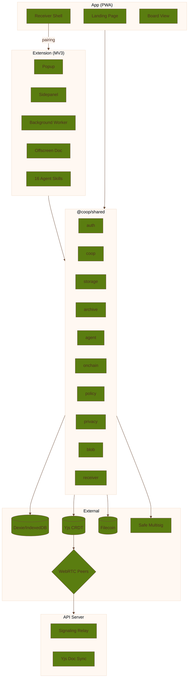

# Coop Architecture

Coop is a Bun monorepo with thin runtime packages and a strong shared domain layer. The architecture
is optimized around one idea: keep capture, review, sync, and bounded execution legible across the
browser surfaces.

## Runtime Split

| Surface | Main Role |
| --- | --- |
| Extension | Primary node for capture, review, publish, sync, and operator work |
| App | Public landing plus receiver PWA shell |
| API server | Signaling relay, health routes, and Yjs WebSocket sync |
| Shared package | Schemas, flows, storage, identity, archive, policy, onchain, privacy, agent, and media modules |

## Data Layers

Coop deliberately uses different storage layers for different jobs:

- Dexie on top of IndexedDB for structured local persistence
- Yjs for shared CRDT state
- y-indexeddb for local persistence of Yjs docs
- y-webrtc for direct browser-to-browser transport
- y-websocket for server-assisted document sync and relay-backed blob transport
- Filecoin-backed archive flows for durable receipts and provenance

## The Product Loop In Architecture Terms

1. Capture enters as tabs, receiver assets, or observations.
2. Local draft state lives in Dexie until a human publishes.
3. Publish writes shared artifacts into the coop's Yjs-backed state.
4. Sync propagates that state across peers through the combined Yjs transport layer.
5. Optional archive actions attach durable receipts to artifacts and snapshots.

## Current Extension Surface Ownership

The current extension action model is split like this:

- `Popup` handles quick capture and quick review
- `Chickens` handles candidates, drafts, and publish prep
- `Coops` handles shared coop state, archive, proof, and board access
- `Roost` handles Green Goods member actions
- `Nest` handles members, operator controls, and settings

Use [Action Domain Map](/reference/action-domain-map) as the canonical current-state view when a doc
needs to answer "where does this action happen?" or "what authority does it require?"

## Major Shared Modules

Some of the most important shared modules are:

- `auth` for passkey-first identity and onchain auth
- `coop` for core workflow, feed, board, publish logic, and the offline outbox
- `storage` for Dexie and Yjs persistence
- `archive` for Storacha and Filecoin flows
- `blob` for media compression and peer-to-peer binary relay via WebRTC data channels
- `member-account` for passkey-backed member account state and onchain helpers
- `policy`, `session`, `permit`, and `operator` for bounded execution
- `agent` for observations, skills, and local automation
- `receiver` for the app-side capture and pairing model
- `privacy` for Semaphore ZK membership proofs and anonymous publishing
- `stealth` for ERC-5564 stealth addresses (secp256k1)
- `erc8004` for on-chain agent registry integration
- `greengoods` for Green Goods garden maintenance, member work submission, operator approvals, GAP admin sync, and Hypercert packaging
- `onchain` for Safe creation, ERC-4337, Kernel member accounts, and Safe co-signers
- `fvm` for Filecoin VM interactions
- `transcribe` for local audio transcription flows

### Cross-Cutting: Design Tokens

A shared design token system (`packages/shared/src/styles/tokens.css`) defines colors, spacing, and
typography scales consumed by both the extension popup and sidepanel views. This keeps visual
consistency across surfaces without duplicating CSS.

## Architectural Rules That Matter In Practice

- keep runtime packages thin
- treat explicit publish as a product boundary
- keep one shared contract layer instead of re-defining types per package
- avoid deep imports when a module already exports a public surface
- preserve mock and live mode paths for onchain and archive integrations

## Where To Go Deeper

- Read [Coop Extension](/builder/extension) for the MV3 runtime breakdown.
- Read [Coop App](/builder/app) for the landing and receiver shell split.
- Read [P2P Functionality](/builder/p2p-functionality) for sync transport details.
- Read [Reference: Coop OS Architecture](/reference/coop-os-architecture-vnext) for the long-form
  source document.
