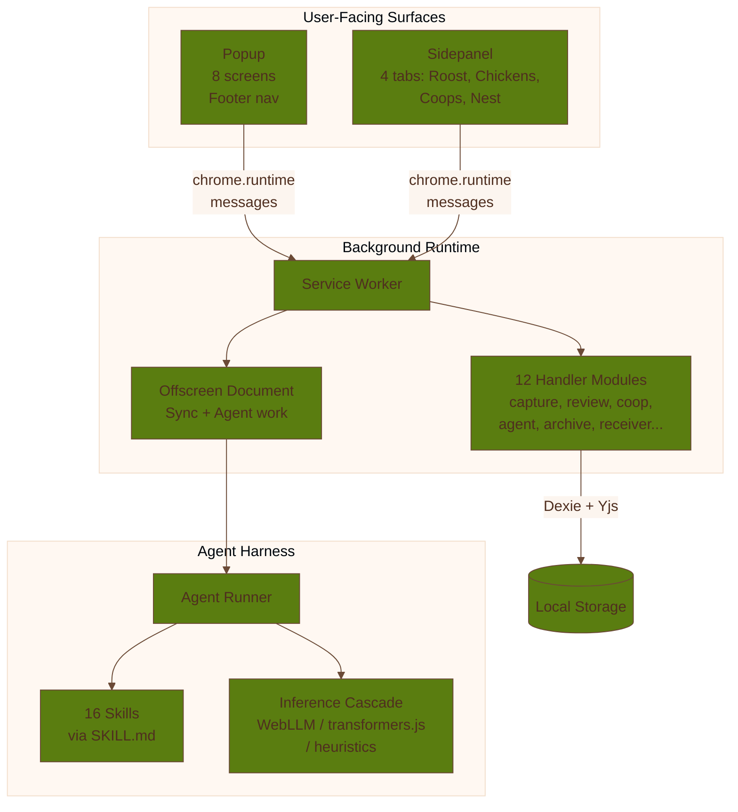

# Coop Extension

The extension is the primary Coop runtime. It is where most creation, review, publish, and operator
actions happen.

For the canonical current-state action grouping, see [Action Domain Map](/reference/action-domain-map).

## Main Surfaces

The MV3 package is split across three user-facing or runtime-facing surfaces:

- **Sidepanel** for the main coop workspace, organized into four tabs: Roost, Chickens, Coops, and Nest
- **Popup** as a full multi-screen app with footer navigation, share menu, onboarding, and theme picker
- **Offscreen document** for background sync and agent work that needs a long-lived browser context

The background service worker coordinates message routing, storage access, and privileged handlers.

### Popup

The popup is a self-contained multi-screen application orchestrated by the `usePopupOrchestration` hook.
`PopupScreenRouter` handles eight screens: home, chickens (drafts), feed, create coop, join coop,
draft detail, no-coop, and profile. A footer nav bar provides three primary tabs: Home, Chickens, and
Feed. Supporting UI includes the share menu, onboarding hero, artifact dialog, and theme picker.

Plain-language role: quick capture and quick review.

### Sidepanel

The sidepanel is the primary workspace surface, organized into four tabs via `SidepanelTabRouter`:

- **Roost** for Green Goods member access, member-account provisioning, and work submission
- **Chickens** for candidates, working drafts, and publish prep
- **Coops** for shared coop state, archive, board, and proof views
- **Nest** for members, receiver pairing and intake, operator controls, and settings

The older product story still uses **Roost** as the metaphor for the human review step. The current
UI no longer uses the sidepanel `Roost` tab as the main general draft-review queue.

### UI Catalog

A standalone UI catalog (`vite.catalog.config.ts`, served on port 3099) provides an isolated
development environment for building and reviewing extension components outside the extension runtime.

## What The Extension Owns

The extension is the home for:

- tab round-up capture
- popup and Chickens review workflows
- coop creation and join flows
- feed and board publishing actions
- sync bindings and signaling configuration
- operator, policy, permit, and session controls
- Green Goods member and operator workflows
- agent harness and inference worker runtime
- receiver pairing and cross-device sync

## Capture Model

Capture can be manual or scheduled. The intended posture is that automatic capture creates candidates
and drafts, but does not auto-publish them.

This keeps the product aligned with its explicit-publish privacy model.

## State And Feedback

The extension also owns the user-facing state cues:

- icon states such as idle, watching, and review-needed
- sound and feedback moments such as the Rooster Call
- runtime status surfaces for sync, archive, onchain mode, and session mode

## Install And Distribution Posture

The reference install doc describes three practical paths:

- local developer install from `packages/extension/.output/chrome-mv3`
- trusted early-access distribution outside the Chrome Web Store
- Chrome Web Store rollout once the extension is ready for broader release

The extension asks for broad capabilities, so review notes and privacy explanations need to stay
unusually clear.

## Builder Advice

- test the sidepanel and the offscreen/runtime path together when changing sync or agent behavior
- use the UI catalog (`bun run dev:catalog` or `vite.catalog.config.ts`) to iterate on components in isolation
- keep the extension as the primary product surface unless a task explicitly moves responsibilities
- avoid pushing shared-domain logic into background-only helpers when it belongs in `@coop/shared`
- test popup screens via `PopupApp.test.tsx` and sidepanel tabs via their respective test files under `tabs/__tests__/`
