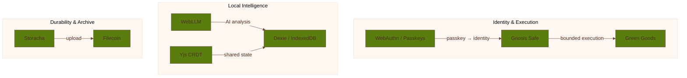

# Integrations

Coop is intentionally built from a small set of external systems that each serve a clear job. This
page is the map before the deeper integration pages.

## Identity And Execution

| Integration | Why It Exists In Coop |
| --- | --- |
| WebAuthN | Passkey-first identity without a wallet-extension-first UX |
| Gnosis Safe | Group smart account and bounded execution surface |
| Green Goods | Garden and governance-adjacent coordination actions |

## Local Intelligence And State

| Integration | Why It Exists In Coop |
| --- | --- |
| WebLLM | Browser-native synthesis and local model execution |
| Yjs | Shared CRDT state across peers |
| Dexie | Structured local persistence on top of IndexedDB |

## Durability And Archive

| Integration | Why It Exists In Coop |
| --- | --- |
| Storacha | Delegated upload and archive workflow |
| Filecoin | Durable storage and provenance story |

## Design Principle

Each integration exists to support the local-first coordination loop. Coop is not trying to become a
generic showcase for standards. If a dependency does not strengthen capture, review, shared memory,
or bounded execution, it should not be in the stack by default.
