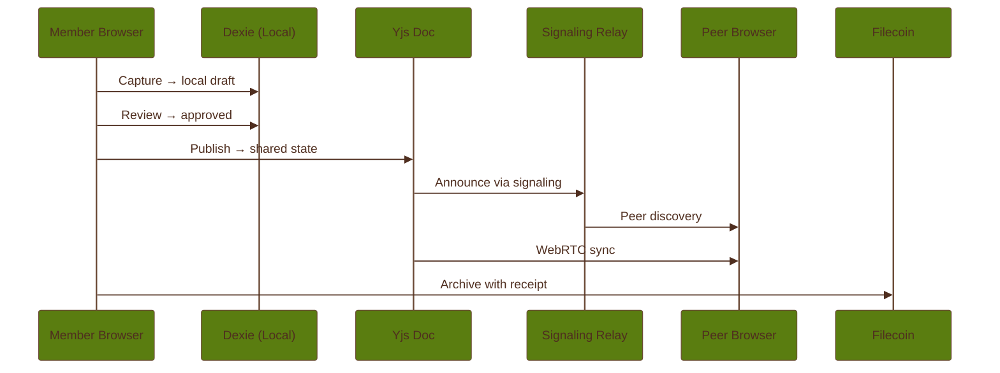

# P2P Functionality

Coop's sync story is local-first replication. It uses direct peer transport where available, but
the current runtime also maintains a hosted Yjs document-sync path so shared state can keep moving
when direct browser connectivity is poor.

## The Stack

The current sync layer combines:

- Yjs for CRDT state
- y-indexeddb for local persistence
- y-webrtc for direct browser-to-browser transport
- a lightweight signaling relay for peer discovery, configured from `VITE_COOP_SIGNALING_URLS`
- y-websocket document sync using the `wss://api.coop.town/yws` base URL (the runtime appends the
  room ID)
- blob relay for binary asset transport (photos, audio, files) via WebRTC data channels, running alongside but separate from CRDT sync
- an outbox pattern for offline-first publish reliability with automatic retry

## What Syncs And What Does Not

Shared coop state syncs across the coop transport layer. Local draft and intake state does not
become shared just because it exists in the browser.

This distinction is essential to Coop's product model:

- shared artifacts, membership state, and archive receipts can replicate
- local review material can stay device-local until publish

## Room Model And Server Role

Sync rooms are derived from coop identity and room secrets.

- y-webrtc uses the room ID plus signaling URLs for peer discovery
- y-websocket uses the same room ID at the `/yws/:room` endpoint
- the checked-in API deployment supports optional persisted room state only when `YJS_PERSIST_DIR`
  is set

`packages/api/fly.toml` does not currently set `YJS_PERSIST_DIR`, so durable server-side Yjs room
persistence should be treated as an available capability, not a guaranteed production property.

## Current Constraints

The long-form scaling review highlights the biggest current risk: not Yjs itself, but how some
shared arrays are written into the document. JSON-serializing full arrays into a Yjs map weakens the
merge story and creates avoidable concurrency risk.

That is why the roadmap prioritizes CRDT correctness work ahead of more ambitious agent features.

## Blob Relay

Binary captures (photos, audio recordings, files) are too large for CRDT state. The blob relay
(`packages/shared/src/modules/blob/relay.ts`) transports them separately over WebRTC data channels
using a chunked protocol. A peer advertises available blobs via a `BlobRelayManifest`, and other peers
request specific blobs by ID. The relay responds with sequenced `BlobRelayChunk` messages, each
carrying a slice of the binary data along with chunk index and total count so the receiver can
reassemble. All relay messages cross a trust boundary and are validated with Zod schemas on arrival.

## Outbox

The outbox (`packages/shared/src/modules/coop/outbox.ts`) queues publish operations when the device
is offline or sync fails. Each entry records the coop, entity key, type, and retry count. When
connectivity returns, pending entries are flushed in order. Entries transition through `pending`,
`synced`, and `failed` states, with failed entries incrementing a retry counter and capturing the last
error. Stale entries older than seven days are pruned automatically.

## Why Builders Should Care

P2P behavior touches:

- join and bootstrap flows
- feed consistency
- receiver-to-extension handoff expectations
- archive provenance and board views

If sync semantics get sloppy, the whole "local-first but shared" promise gets harder to trust.
