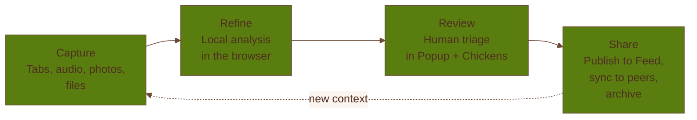

# How It Works

Coop is built around one practical loop: gather context, make sense of it locally, review it with
humans, and then share only what should become part of a group's memory.

## 1. Capture

Capture starts from the places communities already work:

- browser tabs — your Loose Chickens — rounded up from the extension
- audio, photos, files, and links captured from the receiver
- member notes and seed contributions added during coop setup or join flows

The point is not to create more input chores. It is to make useful fragments easier to catch before
they disappear.

## 2. Refine

After capture, Coop can run local analysis in the browser:

- extract the main idea from a page or file
- score whether something looks relevant to the coop's purpose
- cluster related findings
- draft summaries and suggested next steps

This happens before publish. It is meant to reduce noise, not to make irreversible decisions.

## 3. Review

Drafts and candidates are reviewed in the extension's working surfaces, especially the popup and the
`Chickens` workspace. This is where members decide:

- what is actually worth keeping
- what needs editing or re-framing
- which coop or coops a draft belongs to
- whether something should stay local, be shared, or be archived

Review is a product boundary, not a decorative step. Coop is opinionated that a group's memory
should pass through human judgment.

The product story still uses **the Roost** as the metaphor for this judgment step. In the current
sidepanel UI, however, the `Roost` tab is used for Green Goods member access and work submission.

## 4. Share

When a member publishes a draft, it becomes shared coop state. That shared state can then:

- appear in the Coop Feed
- show up in the board view
- sync to peers over the local-first replication layer
- be archived with receipts when the group wants durable proof and provenance

## Where Each Surface Fits

The extension is the primary workspace. Within it:

- the `Popup` handles quick capture, quick review, feed browsing, coop creation and joining, and
  profile management
- `Chickens` handles working candidates, drafts, and publish prep
- `Coops` handles shared coop state, archive, proof, and board access
- `Roost` handles Green Goods member access and work submission
- `Nest` handles members, receiver pairing and intake, operator controls, and settings

The app exists to make mobile and secondary-device capture practical. It is especially useful when a
piece of context starts as a voice memo, photo, or quick link rather than a browser tab.

## What Coop Does Not Do By Default

- It does not auto-publish captured material.
- It does not send raw captures to a cloud inference service as the default path.
- It does not require a wallet-extension-first setup just to participate.
- It does not assume every artifact belongs in long-term storage.

That restraint is part of the product model. Coop should help a group move from context to
coordination without making the trust boundary fuzzy.
