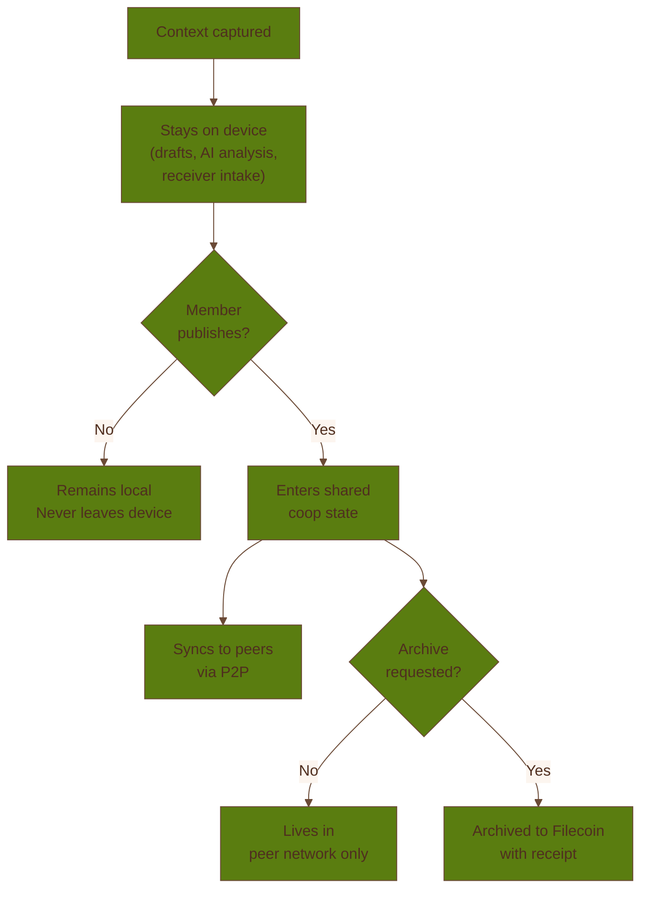

# Privacy & Security

Coop's privacy and security story starts from a product boundary that users can understand: your
device can collect and structure private context locally, but shared coop state begins only when you
publish.

For the formal Chrome Web Store-facing disclosure, see the [Coop Privacy Policy](/privacy-policy).

## Local-First By Default

The current architecture keeps a lot of work on the device:

- raw captures
- local drafts and review material
- receiver intake before conversion
- browser-side AI analysis and observability logs

That gives members room to collect signal without assuming that every draft belongs in a shared
system immediately.

## Passkey-First Identity

Coop is built around passkey identity rather than a wallet-extension-first onboarding. That keeps
join and setup flows closer to familiar web behavior while still leaving room for stronger onchain
account structure behind the scenes.

## Sync Transport And Server Trust

Coop uses two sync transports. They have different privacy properties:

- **WebRTC (y-webrtc)**: Peer-to-peer connections encrypted end-to-end with AES-256-GCM derived from
  the coop's room secret. The signaling server facilitates connection setup but cannot read the
  synced content. This is the primary sync path.
- **WebSocket fallback (y-websocket)**: When direct peer connections are not available, Coop falls
  back to a WebSocket relay (`api.coop.town/yws`). This server receives shared coop state
  (published artifacts, member info, board data) in plaintext over TLS. The server is operated as
  trusted infrastructure and does not store state durably beyond what is needed for active sync
  rooms, but it does have read access to shared state while a room is active.

The WebSocket fallback applies only to **shared** coop state — content a member has explicitly
published. Local captures, drafts, agent memory, and other private data never transit the WebSocket
relay.

## Clear Trust Boundaries

Not every action is equally sensitive. Coop distinguishes between:

- member actions such as capture, review, and publish
- trusted-member or operator actions such as bounded execution, archive handling, or policy work

This is why the product includes approval rules, permits, and time-bounded capabilities. The goal is
to keep more powerful actions explicit and reviewable.

## Anonymous And Private Paths

The repo also includes privacy-preserving extensions for groups that need them:

- anonymous membership proofs for group participation
- stealth-address support for more private receiving onchain

These are important capabilities, but they sit on top of the simpler product promise rather than
replacing it: know what is local, know what is shared, and know who can do what.

Anonymous publishing changes who is attached to a shared artifact, not whether the artifact is
shared. If you publish anonymously, the coop still receives the content.

## Security Posture

Coop's security posture is shaped around a few practical ideas:

- validate inputs and action payloads strictly
- keep privileged execution bounded by policy
- protect against replay and expired authorizations
- avoid swallowing failures so the group can actually see when something went wrong

## Data Sanitization

Before feeding any captured text to the local AI agent, Coop strips potentially sensitive patterns
including email addresses, phone numbers, Bearer tokens, JWTs, hex secrets, and URL tracking
parameters. This happens on-device before inference and is not configurable — it is always active.

Coop also maintains built-in domain exclusion lists for categories including email providers,
banking, health services, and social messaging platforms. Tabs from excluded domains are never
captured. Users can add custom exclusions in the extension settings.

## Known Limits

No current system eliminates all risk. Coop still depends on good role hygiene, sound passkey
practices, and careful treatment of live archive or onchain credentials when those modes are enabled.

The local encryption wrapping secret is stored in the browser's IndexedDB. This protects data in
exports and at rest on disk, but any code with access to the same browser profile's IndexedDB could
theoretically read it. This is a known limitation of browser-based storage — there is no
hardware-backed secure storage available to browser extensions.

The important part is that the system's trust boundaries are meant to stay visible instead of being
hidden inside a black box.
