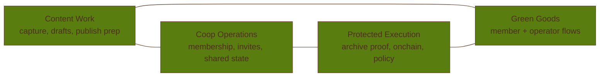

# Coop Action Domain Map

This is the canonical current-state map for how actions are grouped in Coop today.

Use it as the source of truth for three questions:

- which **domain group** an action belongs to
- which **surface** a person uses to perform it
- which **authority or role** is required to execute it

If another current-state doc disagrees with this page, this page wins.

## Reading The Product Labels

Coop keeps the chicken metaphors, but the current UI needs plain-language anchors:

| Label | Plain-language role |
| --- | --- |
| `Popup` | Quick capture and quick review |
| `Chickens` | Working queue for candidates, drafts, and publish prep |
| `Coops` | Shared coop state, feed, archive, and board/proof access |
| `Roost` | Green Goods member workspace |
| `Nest` | Members, operator controls, and settings |
| `Receiver` | Mobile and secondary-device capture |

The older product story still uses **Roost** as the metaphor for human judgment. In the current
extension UI, however, most general draft review work lives in `Popup` and `Chickens`, while the
sidepanel `Roost` tab is reserved for Green Goods member access and work submission.

## Domain Groups

### Capture & Intake

- Browser tab round-up, active-tab capture, screenshots, quick notes, pasted links, file upload,
  and audio capture
- Receiver pairing and Pocket Coop intake
- Local candidate creation before anything becomes shared

### Review & Publish

- Draft editing, categorization, ready-state changes, and share or publish decisions
- Reviewing captured candidates and turning them into working drafts
- Multi-coop routing before something becomes shared state

### Coop Membership & Identity

- Create or join a coop
- Manage invites, membership, coop profile, and receiver pairings
- Passkey-first identity and member-level onboarding

### Archive & Proof

- Archive artifacts and snapshots
- Refresh archive status, export receipts, and open board or proof views
- Optional anchoring and FVM registration for stronger provenance

### Green Goods Member Actions

- Provision a member account
- Submit work into a linked Green Goods garden
- Accept gardener membership changes that affect the member's role in the garden

### Green Goods Operator Actions

- Bootstrap and maintain the coop-owned garden
- Approve work, create assessments, reconcile GAP admins, and manage gardener bindings
- Package approved work and assessments into Hypercert and Karma GAP workflows

### Governance / Delegation / Automation

- Action policies and approval queue
- Permits, session capabilities, agent plans, and trusted-node execution controls
- Bounded privileged execution rather than open-ended automation

### Settings / Privacy / Local Device Controls

- Theme, sound, runtime preferences, and local inference opt-in
- Auth session management and local data clearing
- Privacy posture and local-device behavior settings

## Overlap View

The most useful mental model is not a literal screen-by-screen Venn diagram. It is an overlap
between content work, coop operations, and protected execution.

- `Content Work ∩ Coop Operations` is where drafts become shared coop memory.
- `Coop Operations ∩ Protected Execution` is where policies, permits, sessions, archive, and admin
  flows live.
- `Content Work ∩ Protected Execution` is where archived evidence and onchain-bound work become
  verifiable.
- `Green Goods` spans both content and protected execution because member work starts as content,
  then moves through guarded operator and onchain workflows.

## Surface Matrix

| Surface | Plain-language role | Primary actions | Main domain groups |
| --- | --- | --- | --- |
| `Popup` | Quick capture and quick review | Notes, paste, round-up, screenshot, quick draft review, feed browse, create or join coop, profile | Capture & Intake, Review & Publish, Coop Membership & Identity |
| `Chickens` | Working queue for candidates and drafts | Review candidates, edit drafts, run capture actions, prepare publish decisions | Capture & Intake, Review & Publish |
| `Coops` | Shared coop state and proof | Browse coop state, open board, archive artifacts or snapshots, export proof, inspect published artifacts | Coop Membership & Identity, Archive & Proof |
| `Roost` | Green Goods member workspace | Provision member account, inspect Green Goods access, submit work | Green Goods Member Actions |
| `Nest` | Members, operator controls, and settings | Invite members, manage receiver pairings and intake, set policies, inspect queue, issue permits or sessions, run agent or operator controls, adjust settings | Coop Membership & Identity, Governance / Delegation / Automation, Settings / Privacy / Local Device Controls, Green Goods Operator Actions |
| `Receiver` | Mobile capture | Record audio, take photos, attach files, save links, pair to the extension | Capture & Intake |

## Authority Matrix

| Authority / Role | Who holds it | What it is for | What it is not for |
| --- | --- | --- | --- |
| `member` | Any coop participant | Capture, review, publish, standard coop participation | Privileged operator execution |
| `trusted member` | Elevated coop steward | Invites, operator review, garden or admin oversight, approval participation | Universal Safe signing for every member |
| `member account` | Individual member with onchain agency | Gardener lifecycle actions and direct work submission | Shared treasury or operator-only actions |
| `session capability` | Bounded executor authorized by a Safe owner | Green Goods garden bootstrap and maintenance only | Member work submission, approvals, assessments, GAP admin sync, Hypercert packaging |
| `permit` | Delegated off-chain executor | Archive-related and publish-related delegated execution | Green Goods onchain execution |
| `safe owner` | Small trusted signer set | Proposal-first admin actions, approvals, assessments, GAP admin sync, Hypercert packaging, Safe administration | Everyday member capture or publish work |

## Green Goods Current State

Green Goods is the most important place where the domain, surface, and authority views meet.

- Coop currently treats Green Goods as a bounded onchain coordination layer.
- There are three Green Goods EAS schemas in scope: `work`, `work approval`, and `assessment`.
- Direct member action is limited to **work submission** from the `Roost` workspace once a member
  account and linked garden are in place.
- Operator-side actions include **work approval**, **assessment creation**, **GAP admin sync**,
  gardener lifecycle management, and garden maintenance.
- Impact packaging happens through **Hypercert** and **Karma GAP** operator workflows after work has
  already been approved and assessed.
- Coop does **not** treat impact reporting as a direct member EAS attestation path in the current
  model.
